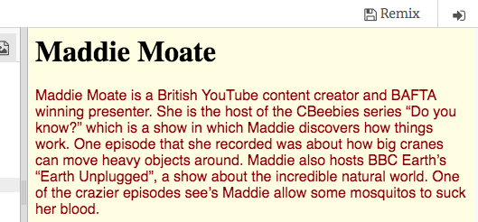

## Add style to your web page

The language that describes how a website looks is called **CSS**. This stands for 'cascading style sheets'.

--- task ---

Look at the top of the code panel in the trinket. Click on the tab that says `stylesheet.css`.

Change the value `White` to `LightYellow`, and see what happens to your web page.

```css
body {
  background-color: LightYellow;
}
```


--- /task ---

--- collapse ---
---
title: How does it work?
---

If you look at the top of the `index.html` file, you will see the following line:

```html
  <link type="text/css" rel="stylesheet" href="stylesheet.css"/>
```

This line of code tells the browser to look for a special file named `stylesheet.css`. This special file is called a **style sheet**. You can recognise a style sheet file by the `.css` in its name.

A style sheet contains **rules** for what the HTML elements on your web page should look like.

The curly braces `{ }` and the code in between them are a set of **CSS rules**. The word `body` means that the rules are for all the `<body>` elements on your website. We call the bit in front of the curly braces a **selector**. So in this case, it is the selector for the `<body>` elements.

Each rule inside the curly braces is made up of:
  - A **property** on the left, followed by a colon symbol `:`
  - After the colon, on the right-hand side, a **value** for the property
  - A semicolon symbol `;` at the end

--- /collapse ---

--- task ---

Let's add two new **CSS rules** for the `<p>` tag: one for the text's `color`, and one for the text's `font-family`.

```css
body {
  background-color: LightYellow;
}
p {
  font-family: "Helvetica", sans-serif;
  color: DarkRed;
}
```



Notice the changes?

The `color` property changes the colour of all text inside the selector, the `<p>` tags. `font-family` changes how the letters of the text look.

--- /task ---

--- task ---

Next, you're going to use the `text-align` property on your `<h1>` tags to horizontally centre your heading. We can use the following values for this: `left`, `right`, or `center`. Try them out to see what they do!

```css
h1 {
    text-align: center;
}
```

--- /task ---

--- task ---

Finally, you're going to add margins. The `margin` properties are used to create space around your elements. You are going to add a margin to the top of your `<p>` tag. The four margin properties are `margin-top`, `margin-right`, `margin-bottom`, and `margin-left`.

```css
p {
  font-family: "Helvetica", sans-serif;
  color: DarkRed;
  margin-top: 100px;
}
```

This moves the paragraph down the page `100px`. `100px` means one hundred **pixels**, which are the tiny dots that make up what you're seeing on your screen. You can delete this gap if you don't like it, but knowing how to add margins to your HTML elements will be useful later in the project to move other things you'll add to your web page, such as pictures and videos.

--- /task ---


