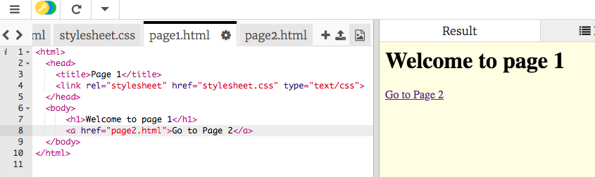

## Challenge: more pages

--- challenge ---

Using what you've learnt, create more webpages about members of your favourite band, the cast of your favourite movie/tv show or the players on your favourite sports team.

--- collapse ---
---
title: How to create a new page on Trinket
---

+ Click the plus button to the right of your current pages i.e. index.html and stylesheet.css

+ Enter a file name eg bandmember1.html or eddiemurphy.html **Remember to include the `.html`!**

+ Copy and paste the basic html code often called **boilerplate code**

``` html
    <html>
    <head>
        <title>My Title</title>
        <link rel="stylesheet" href="stylesheet.css" type="text/css">
    </head>
    <body>
        
    </body>
    </html>
```

--- /collapse ---

--- collapse ---
---
title: How to go between my pages
---

+ To create a link between two of your pages you must use the `<a> </a>` tag

+ Put the `attribute` called `href` in the opening tag and set it `=` to the filename of the page you would like to link to. The text between both tags is displayed on your webpage as the link.

``` html
    <html>
    <head>
        <title>Page 1</title>
        <link rel="stylesheet" href="stylesheet.css" type="text/css">
    </head>
    <body>
        <h1>Welcome to page 1</h1>
        <a href="page2.html">Go to Page 2</a>
    </body>
    </html>
```



--- /collapse ---

--- /challenge ---