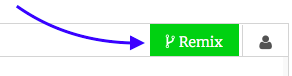
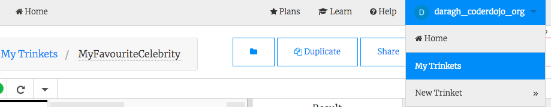

## Getting started

--- task ---

Go to the [the starter Trinket](https://trinket.io/html/15bfdbad45){:target="_blank"}. Here, you will see a box containing an example website project. On the right-hand side is the website, and on the left-hand side is the code that makes the website.


<!--- starter trinket needs dojo.soy link? -->

--- collapse ---
---
title: I have a Trinket account
---

- Click the **Remix** button at the top right of the project. If you are not signed in, you will be prompted to do so. Once you've signed in, you'll  need to click  **Remix** again. Clicking this button creates a copy of the project for you to work with. 



It should say **remixed** after you click it:


--- /collapse ---

--- collapse ---
---
title: I don't have a Trinket account
---

**Note:** this project can be completed without an account on trinket.io, however without an account you will not be able to use your own pictures. Please create an account if you wish to use your own pictures. Instructions on how to do this are below.

You can save your work by using one of the options in the **Share** menu. You will get a link that you can either save somewhere, for example in a document, or send to someone via email.
**Note:** each time you make a change, you will get a new link.

If you want to create an account on Trinket, follow the steps below. This will allow you to access your work easily from any computer, and to **remix** projects somebody else has shared with you. Remixing means you will save a copy of a project so you can make your own changes to it.

- Go to [the Trinket website](http://dojo.soy/trinket) and click **Sign Up For Your Free Account**. You will need an email address to sign up. 

- Enter your email address and choose a password, or ask somebody to do this for you.

- You can now access all your saved or remixed projects by clicking on your username and going to **My Trinkets**.


--- /collapse ---

--- /task ---

--- task ---

Find the line that says `<p>Hello World</p>` and replace the text between `<p>` and `</p>` to say who your favourite celebrity is. **Don't** remove the `<p>` and `</p>`. These are **paragraph** tags. They are used to define a paragraph of text. You should see your webpage change on the right-hand side. 


--- /task ---

--- task ---

Add a new line and this time use `<h1>` and `</h1>` instead of `<p>` and `</p>`. These are **heading** tags. It enlarges the text and makes it bold.

```html
  <h1>Welcome to my webpage!</h1>
```

--- collapse ---
---
title: HTML and tags explained
---

**HTML** is the code that makes a webpage.

The `.html` in the file name tells the browser that the file is a webpage, so the browser knows to look for **tags** telling it what to display. (A browser is the program you use to look at websites, for example Google Chrome or Mozilla Firefox.)

HTML tags such as `<p>` and `</p>` define different pieces of a page, for example paragraphs, headings, or the body. The pieces are all called **elements**. Think of them as building blocks.

### Why do I need two tags? 
You need an **opening** and a **closing** tag to tell the browser where elements **start** and **end**. So for a paragraph, the opening `<p>` tag says "Here comes some text that I want you to display as a paragraph." The closing `</p>` tag tells the browser where the paragraph ends. 

Everything in between the `<body>` and `</body>` tags is your webpage. 

- Notice how the closing tag **always** has a forward slash `/`.
  
--- /collapse ---

--- /task ---

--- task ---

Change the number in your **heading** tags to see the different sizes available. They can go from `<h1>` to `<h6>`. Remember to change the number in both the opening and closing tags!

--- /task ---

Congratulations! You have built your first webpage. Next you will style your webpage.