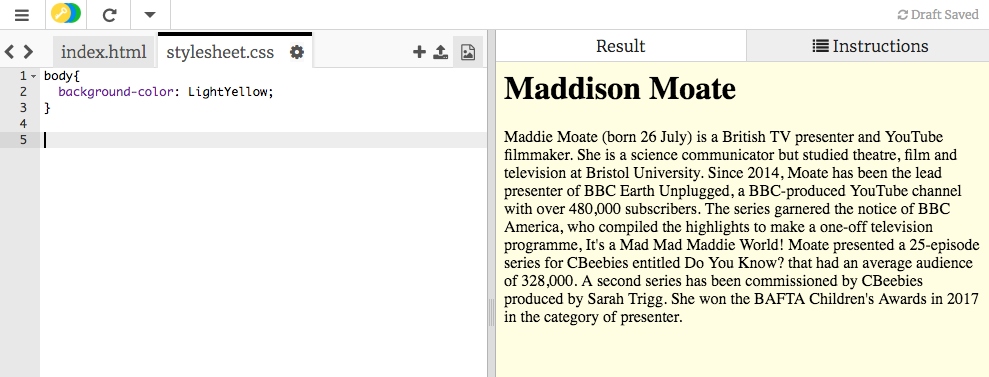
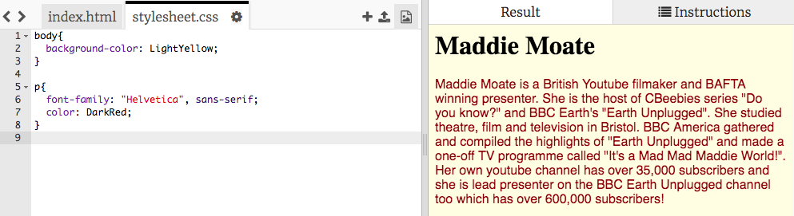

## Styling your webpage

The code that describes how a website looks is called CSS.

+ Look at the top of the code panel on Trinket. Click on the file called `stylesheet.css`.

+ Change the value `White` to `LightYellow` and see what happens to your page.

```css
body{
  background-color: LightYellow;
}
```



--- collapse ---
---
title: How does it work?
---

If you look at the top of the `index.html` file, you will see the following line:

```html
  <link type="text/css" rel="stylesheet" href="stylesheet.css"/>
```

The above line tells the browser to look for a special file named `stylesheet.css`. This special file is called a **style sheet**. You can recognise a style sheet file by the `.css` in its name. 
  
A style sheet contains **rules** for what each element on your webpage should look like.

The curly braces `{ }` and the code in between them are a set of **CSS rules**. The word `body` means that the rules are for all the `<body>` elements on your website. We call the bit in front of the curly braces a **selector**. So in this case, it is the selector for the body elements.

Each rule inside the curly braces is made up of:
  - A **property** on the left, followed by a colon symbol `:`
  - A **value** for the property on the right-hand side after the colon
  - A semi-colon symbol `;` at the end
   
--- /collapse ---

+ Let's add two new **CSS rules** for the `<p>` tag. One for the text `color` and one for the text `font-family`.

```css
body{
  background-color: LightYellow;
}
p{
  font-family: "Helvetica", sans-serif;
  color: DarkRed;
}
```



+ Notice the changes?

The `color` property changes the colour of all text inside the selector, `<p>` tags. `font-family` changes how the text looks.

+ Next you are going to use the `text-align` property on your `<h1>` tags to horizontally centre your heading. We can use these values for this: `left`, `right` or `center`. Try them out to see what they do!

```css
h1{
    text-align: center;
}
```