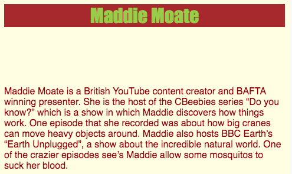

--- challenge ---

## Challenge: style your heading

+ Make your heading `YellowGreen` with a `Brown` background and use the `Impact` font.

--- hints ---

--- hint ---

To create CSS rules, you must have a selector, e.g. `h1`, and some curly braces `{ }` to put the rules in.

--- /hint ---

--- hint ---

+ A rule must have a property, e.g. `color`, followed by a colon `:` and a value, e.g. `Blue`
+ A rule must always end with a semi-colon `;`

--- /hint ---

--- hint ---

Here are some rules for a `<h1>` tag:

```css
  h1 {
    font-family: "Impact", sans-serif;
    color: YellowGreen;
    background-color: Brown;
  }
```

--- /hint ---

--- /hints ---

--- /challenge ---

You can find more fonts [here](https://www.w3schools.com/cssref/css_websafe_fonts.asp){:target="_blank"} and more colours [here](https://www.w3schools.com/colors/colors_names.asp){:target="_blank"}.

Next, you'll learn about adding images to your web page.


