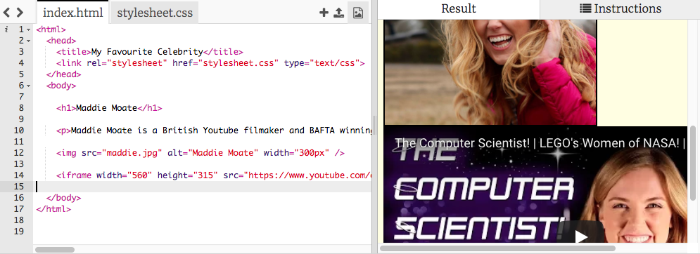

## Including YouTube videos in your webpage

YouTube provides an easy way for you to include its videos in your webpage. Adding elements from other online sources is called **embedding**. Let's include a video about your celebrity. This example adds a video from Maddie's YouTube channel but you could add an interview, music video or movie trailer with your favourite celebrity.

--- task ---

Find a video on YouTube that you want to show on your website. 

+lick on the **Share** button below the video, beside the likes. Select the option **Embed**.

You will see a text box with some code in it. You need to copy the text. First it must be selected. You can select it all by clicking on it and pressing the <kbd>Ctrl</kbd> (or <kbd>cmd</kbd> on a Mac) and <kbd>A</kbd> keys at the same time.

Press the <kbd>Ctrl</kbd> (or <kbd>cmd</kbd> on a Mac) and <kbd>C</kbd> keys together or right click and select 'copy' to copy the text.

--- /task ---

--- task ---

Then go back to your website's HTML code, and click in the place where you want to put the video, for example below a heading or paragraph. **Paste** the code by pressing <kbd>Ctrl</kbd> (or <kbd>cmd</kbd> on a Mac) and <kbd>V</kbd> on your keyboard at the same time or right click and select paste. Don't worry about understanding all the code you just pasted!

You should see the video appear on your webpage.

If you look carefully, you should find `width` and `height` **attributes** in the pasted code. You can change their values to make the video appear bigger or smaller.

--- /task ---