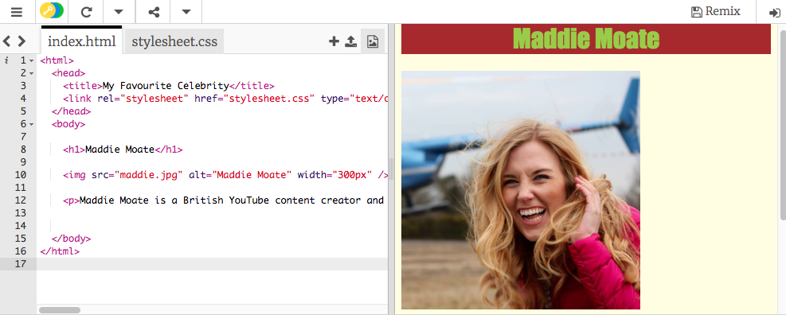
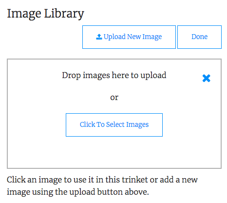

## Adding images to our webpage

Let's add a picture!

+ Go to the tab named `index.html`. Type the following anywhere between the `<body> </body>` tags: 

```html
    
```

Here's what the result should look like:
    


Notice that this tag has extra bits of information inside it. They are called **attributes**.

+ Find the bit of code that says `width="200px"` and try experimenting with different numbers to see if you can figure out what this attribute does. Don't delete the letters `px`!

--- collapse ---
---
title: How the img tag works
---

Notice that the `` tag is different from the other tags you've used so far — there is no closing `</img>` tag. Instead, this tag is **self-closing**: it has `/>` at the end. This is because there is no 'start' and 'end' to an image element like there is for text on the page. 

The tag contains **attributes** with extra information:
- The `src` attribute tells the browser what file to use for the picture. 
- The `alt` attribute is a short description that the browser will show if it cannot display the picture. 'alt' is short for 'alternative'. This text also helps people using a screen reader to know what the picture is.
- The `width` attribute tells the browser how wide to make the picture. `100px` means one hundred **pixels**, which are the tiny dots that make up what you're seeing on your screen. If you don't include this attribute, the picture will be displayed in its original size.

--- /collapse ---

Now that you know the code to put a picture on your website, you probably want to change the picture, right? **If you have a Trinket account** you can follow the instructions below to get your picture on your website. If you don't have an account, you can use the rocketship already available on Trinket or keep the picture of Maddie.

+ The first thing you will need is, of course, a picture! You can either use one you've already got on your computer, such as a photograph you took, or you can get one from the internet.

[[[generic-get-picture-from-web]]]

**Note:** not all images you will find on the internet are free for anyone to use. If you download a picture, you should make sure it is one that you are allowed to use. Find out more about this here:

[[[images-permissions-to-use]]]

Once you have a picture, you can **upload** the file to Trinket: 

+ In your Trinket, click on the **image** icon next to the **+** sign. 


This is where you can see the pictures that you are able to use on your website. You should see the picture of Maddie.

- Click the button **Image Library** and then click **Upload New Image**. 

- Click on the button **Click To Select Images**. Find and double-click your image file in the window that opens.

- Click **Done**.



Your picture will be uploaded and should be ready to use.

- Go to the file `index.html` and find the `` tag. Change the text `maddie.jpg` so that it exactly matches the name of the image file you've chosen. Note that its name might end in `.png` instead of `.jpg`!

The text you just changed is the attribute called `src`, which is short for source and tells the browser which file to display.

**Note:** the value you type for an attribute must have quotation marks `" "` around it!

+ Next let's add a border on the `img` with **CSS** (so be sure to change back to the `.css` file). The property we need here is `border`. There are plenty of different border options, the full list can be found here: **[Borders](https://www.w3schools.com/css/css_border.asp)**. I will use the shortest one as can be seen below:

```css
img{
    border: 2px solid Black; 
}
```

The first value here `2px` is the width of the border in pixels( the little dots that make up our screens ). The second value describes the border style, in our case it's `solid` but you could have `dotted` or `dashed` too. The final one is the border colour.

--- challenge ---

## Challenge: change the alt text of the picture

- Find the `alt` attribute of your image element and change the text in it to a short description of your picture. This attribute is used when the browser can't find your file or to help people with screen readers understand what the picture is. Instead it will display your **alternative** text or read it aloud. 

--- /challenge ---

