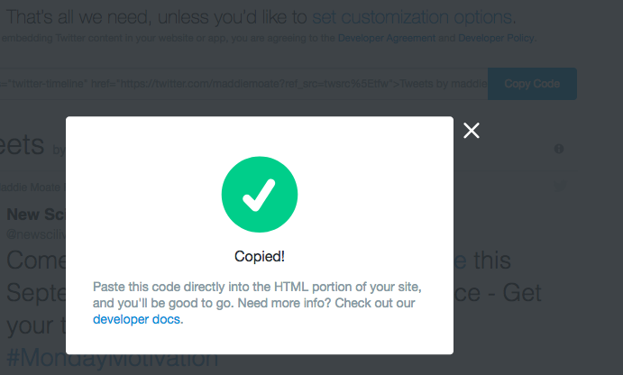

## Inserting a Twitter profile in your webpage

Twitter also provides an easy way for you to use its services in your webpage. This example is going to **embed** Maddie's Twitter profile on the webpage, add your favourite celebrity's profile too if they have a Twitter.

--- task ---

First, find your celebrity on Twitter and copy the `URL` at the top of your browser as seen in the image below

--- /task ---

--- task ---

Next, go to [publish.twitter.com](https://publish.twitter.com) and paste the `URL` in the box in the middle of the page and click the arrow beside the box. 

Select the Embedded Timeline option on the left

Now you can select customisation options if you would like. Click on `customization options` and change the `How would you like this to look?` setting from `Light` to `Dark` or update the `Width` and `Height`. Change whatever options you would like to and then click `update`.

When you are done or if you didn't change any settings, click the `Copy Code` button and you should get a message "Copied!" to pop up on screen.

--- /task ---

--- task ---

Then go back to your website's HTML code, and click in the place where you want to put the Twitter profile and paste the code. Again, don't worry about understanding all the code you just pasted!

--- /task ---