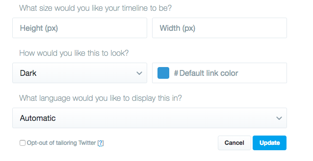
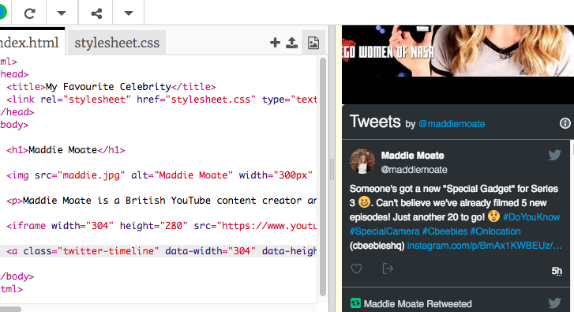

## Display a Twitter profile

Twitter also provides an easy way for you to use its services on your web page. This example is going to embed Maddie's Twitter profile on the web page, add your favourite celebrity's profile too if they have a Twitter.

--- task ---

First, find your favourite celebrity on Twitter, and copy the web address that's your browser's address bar, as seen in the image below.

(Did you know the technical term for 'web address' is 'URL', which stands for 'Uniform Resource Locator'?)

--- /task ---

--- task ---

Next, go to [publish.twitter.com](https://publish.twitter.com), paste the URL in the box in the middle of the page, and click the arrow beside the box. 

Then select the **Embedded Timeline** option on the left.

Now you can select customisation options if you like. Click on **Customization options** and change the **How would you like this to look?** setting from **Light** to **Dark** or update the **Width** and **Height**. Change whatever options you would like, and then click **update**.

When you are done, or if you didn't change any settings, click the **Copy Code** button. This should make the message "Copied!" pop up on your screen.

--- /task ---

--- task ---

Then go back to your website's HTML code, click in the place where you want to put the Twitter profile, and paste the code. Again, don't worry about understanding all the code you just pasted!

--- /task ---

