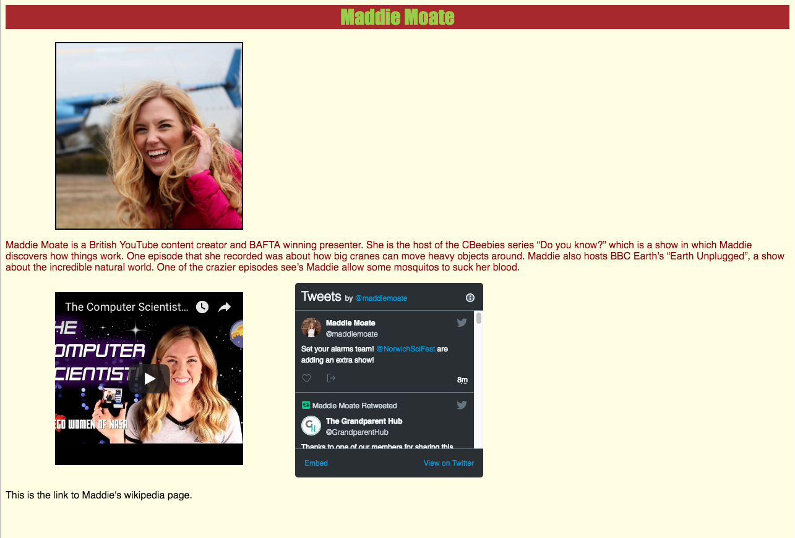

## Create links to other websites

Now you're going to add a **link** to another website to your page. As my example, I will add a link to Maddie's Wikipedia page: [wikipedia.org/wiki/Maddie_Moate](https://en.wikipedia.org/wiki/Maddie_Moate)

--- task ---

To link to another website, you need to use the `<a> </a>` tags. `a` is short for **anchor**. This is the code for my example link: 

```html
<a href="https://en.wikipedia.org/wiki/Maddie_Moate" >This is the link to Maddie's Wikipedia page.</a>
```

The `href` attribute should contain the URL of the website that you wish to link to. The text between `<a>` and `</a>` is the text that will appear on your page and that people will be able to click on to go to the linked website.


--- /task ---

--- task ---

By default, any links you add will be blue and have a line under them. To change how they look, you can use the following CSS rule:

```css
a {
    text-decoration: none;
    color: black;
}
```

You can easily move your link to a new line too! Just surround it by paragraph tags `<p>`:

```html
<p><a href="MyLink">My Text</a></p>
```

--- /task ---

--- collapse ---
---
title: Some links not working?
---

Most big web services, such as Twitter and Facebook, don't allow their website to be opened in an `<iframe>`, which is what Trinket uses to show you your website in the box on the right-hand side. If you download your HTML code and open it with a browser, links to such sites will work, because your browser doesn't use iframes. But if you include the attribute `target="_blank"` in the `<a>` anchor tag of a link, it will work in Trinket: the linked website will open in a new browser tab.

```html
<a href="https://www.twitter.com/" target="_blank">Opens in a new tab</a>
```

--- /collapse ---


