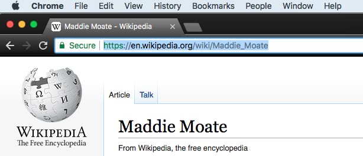

## Add links to other websites

Next we are going to add a **link** to another website. I'm going to add a link to Maddie Moate's wikipedia page: wikipedia.org/wiki/Maddie_Moate

+ To link to another website we need to use the `<a> </a>` tags. `a` is short for **anchor**. Here is the code for my link: 

```html
<a href="https://en.wikipedia.org/wiki/Maddie_Moate" >This is the link to Maddie's wikipedia page.</a>
```

+ the `href` attribute should contain the **URL** of the website that you wish to go to. The text between `<a>` and `</a>` is the text that will appear on your webpage as a link. The URL for the page you want to add will be located at the top of your browser in the **address bar**



--- collapse ---
---
title: Some links not working?
---

Most websites like Twitter and Facebook don't allow their website to be opened in an `<iframe>` which is what trinket uses to show you your website. Links like these will work if you download your code and open it in a browser. If you include the attribute `target="_blank"` in the anchor tag, it works in trinket but it opens your link in a new tab! 

```html
<a href="https://www.twitter.com/" target="_blank">Opens in a new tab</a>
```

--- /collapse ---

Let's create a few links in a **list** to get to our celebrity's social media pages.

+ To create an **unordered list** we must use the `<ul> </ul>` and `<li> </li>` tags.

+ Each **list item** must have `<li> </li>` tags around it.


Next we will look at some more CSS!