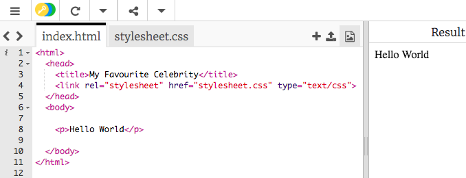
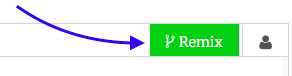
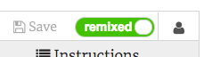
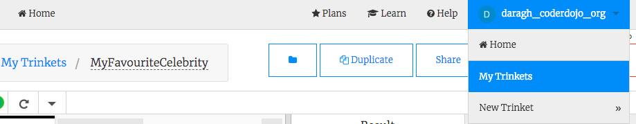
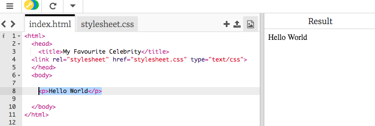
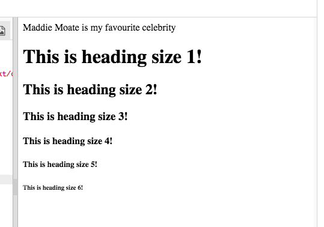

## शुरू करें

** ध्यान दें: ** आप trinket.io पर एक खाते के बिना इस प्रोजैक्ट को पूरा कर सकते हैं, लेकिन एक खाते के बिना आप अपनी खुद की तस्वीरों का उपयोग करने में सक्षम नहीं होंगे। यदि आप अपनी स्वयं की तस्वीरों का उपयोग करना चाहते हैं तो कृपया एक खाता बनाएँ। ऐसा करने के निर्देश नीचे दिए गए हैं।

--- task ---

[स्टार्टर ट्रिंकेट (starter trinket) ](http://dojo.soy/celebrity) {:target="_blank"} को खोलें | आपको एक बॉक्स दिखाई देगा जिसमें एक उदाहरण वेबसाइट प्रोजैक्ट होगी। वहाँ दाईं ओर वेबसाइट है, और बाईं ओर वह कोड है जो वेबसाइट बनाता है।



--- collapse ---
---
title: मेरे पास Trinket अकाउन्ट है
---

- प्रोजेक्ट के शीर्ष दाईं ओर बने**Remix ** बटन पर क्लिक करें । यदि आपने साइन इन नहीं किया हुआ है, तो आपको ऐसा करने के लिए कहा जाएगा। साइन इन करने के बाद, आपको ** Remix** बटन पर दुबारा क्लिक करना होगा। इस बटन पर क्लिक करने से प्रोजेक्ट की एक कॉपी बन जाती है जिस पर आप काम कर सकते हैं।



क्लिक करने के बाद बटन पर **emixed** लिखा होना चाहिए:



--- /collapse ---

--- collapse ---
---
title: मेरे पास Trinket खाता नहीं है
---

आप ** Share** मेन्यू में से किसी एक विकल्प का उपयोग करके अपना काम सहेज सकते हैं । आपको एक लिंक मिलेगा जिसे आप कॉपी कर सकते हैं और या तो कहीं भी सहेज सकते हैं, उदाहरण के लिए अपने कंप्यूटर पर किसी टेक्स्ट फाइल में, या ईमेल के माध्यम से किसी को भेज भी सकते हैं।

** ध्यान दें: ** हर बार जब आप अपने कोड में बदलाव करते हैं, तो आपको एक नया लिंक मिलेगा।

यदि आप ट्रिंकेट पर एक अकाउन्ट बनाना चाहते हैं, तो नीचे दिए गए चरणों का पालन करें। यह आपको आसानी से किसी भी कंप्यूटर से अपने काम तक पहुँचने की सुविधा देगा तथा किसी और के द्वारा शेयर की गयी प्रोजेक्ट आप ** रीमिक्स (remix)** भी कर पाएंगे। रीमिक्सिंग (Remixing) का मतलब है कि आप किसी प्रोजेक्ट की एक कापी सहेजेंगे ताकि आप उसमें खुद बदलाव कर सकें।

- [Trinket](http://dojo.soy/trinket) वेबसाइट पर जाएं और **Sign Up For Your Free Account** पर क्लिक करें । साइन अप करने के लिए आपको एक ईमेल की आवश्यकता होगी।

- अपना ईमेल दर्ज करें और एक पासवर्ड चुनें, या यह करने में किसी की सहायता ले।

- अब आप अपने उपयोगकर्ता नाम (username) पर क्लिक करके अपनी सभी सहेजी गई या रीमिक्स की गई प्रोजेक्ट को **My Trinkets** पर जाकर देख सकते हैं।



--- /collapse ---

--- /task ---

--- task ---

उस लाइन को खोजें जिसमें `<p>Hello World</p>` लिखा है और `<p>` और `</p>` के बीच लिखे टेक्स्ट को अपने पसंदीदा हस्ती के नाम से बदल दें। `<p>` और `</p>` को **ना** हटाएं। ये HTML के **पैराग्राफ (paragraph)** टैग हैं। इनका उपयोग टेक्स्ट (text) के एक पैराग्राफ (paragraph) को परिभाषित करने के लिए किया जाता है। आपको अपना वेबपेज दाईं ओर अपडेट होता दिखना चाहिए।



--- /task ---

-- task ---

एक नई पंक्ति जोड़ें, और इस बार `<p>` और `</p>` के बजाय `<h1>` और <1>&lt;/h1&gt;</1> का उपयोग करें। ये HTML के **हैडिंग (heading)** टैग हैं। वे अपने बीच में लिखे टेक्स्ट (text) को बड़ा करते हैं और इसे बोल्ड (bold) बनाते हैं।

```html
  <h1> मेरे वेबपेज में आपका स्वागत है! </h1>
```

--- collapse ---
---
title: HTML और टैग की व्याख्या
---

**HTML** वह भाषा है जो आपके वेब पेज को बनाती है।

`.html` फाइल के नाम में, जिसे आप trinket के बाईं ओर के शीर्ष पर देख सकते हैं, ब्राउज़र को बताता है कि फाइल एक वेब पेज है, इसलिए ब्राउज़र ** टैग ** को खोजता है जो उसे यह बताते हैं की क्या प्रदर्शित करना है। (एक ब्राउज़र वह प्रोग्राम है जिसका उपयोग आप वेबसाइटों को देखने के लिए करते हैं, उदाहरण के लिए Google Chrome या Mozilla Firefox।)

HTML टैग्स जैसे `<p>` और ` </p>` पृष्ठ के विभिन्न टुकड़ों को परिभाषित करते है, उदाहरण के लिए पैराग्राफ (paragraph), हैडिंग (heading) या बॉडी (body)। इन टुकड़ों को **एलीमेंट्स (elements)** कहा जाता है । उन्हें वेबपेजेस के निर्माण की ईंटों के रूप में सोचें।

### मुझे दो टैग की आवश्यकता क्यों है?
आपको एक टैग ** खोलने ** और एक टैग ** समापन ** के लिए चाहिए ताकि ब्राउज़र को बता सकें की एलीमेंट् (element) कहाँ **शुरू** होते हैं और कहाँ **अंत** । तो एक पैराग्राफ (paragraph) के लिए, शुरू का `<p>` टैग कहता है "यहां कुछ टेक्स्ट (text) है जो मैं चाहता हूं कि आप ब्राउज़र को एक अनुच्छेद के रूप में प्रदर्शित करें।" और समापन ` </p>` टैग उस ब्राउज़र को बताता है कि कहाँ पैराग्राफ समाप्त होता है।

`<body>` और `</body>` टैग के बीच सब कुछ आपका वेबपेज है।

- ध्यान दें कि कैसे बंद होने वाले टैग के आगे ** हमेशा** एक स्लैश `/` होता है।

--- /collapse ---

--- /task ---

--- task ---

उपलब्ध हैडिंग (heading) आकारों को देखने के लिए अपने हैडिंग (heading) टैग में संख्या बदलें। वे `<h1>` से `<h6>` तक जा सकते हैं। खोलने और समापन करने वाले दोनों ही टैग में नंबर बदलना याद रखें!

--- /task ---

बधाई हो, आपने अपना पहला वेबपेज बना लिया है! अब, आप वेब पेज को स्टाइल (style) करेंगे!


