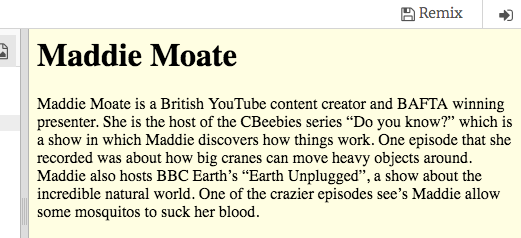
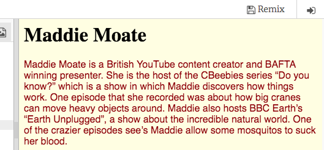
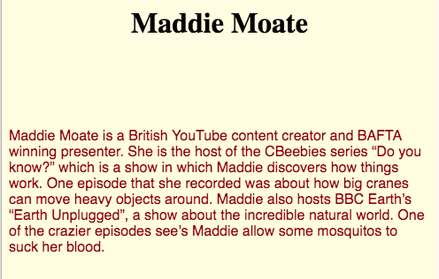

## अपने वेब पेज पर स्टाइल (style) जोड़ें

वह कोड जो यह बताये कि वेबसाइट कैसा दिखता है, उसे **CSS** कहते हैं। इसका अर्थ 'कैस्केडिंग स्टाइल शीट (cascading style sheets)' है।

--- task ---

Trinket में कोड पैनल के शीर्ष पर देखें। उस टैब पर क्लिक करें जहाँ `stylesheet.css` लिखा है ।

वैल्यू (value) को बदलकर `White` से `LightYellow` करें, और देखें कि आपके वेब पेज पर क्या होता है।

```css
body {
  background-color: LightYellow;
}
```



--- /task ---

--- collapse ---
---
title: यह कैसे काम करता है?
---

यदि आप शीर्ष पर `index.html` फाइल को देखते हैं, आपको निम्न पंक्ति दिखाई देगी:

```html
  <link type="text/css" rel="stylesheet" href="stylesheet.css"/>
```

यह पंक्ति ब्राउज़र को एक विशेष फ़ाइल की तलाश करने के लिए कहती है जिसका नाम `stylesheet.css` है। इस विशेष फाइल को **स्टाइल शीट (style sheet)** कहा जाता है । पीला रंग का बैकग्राउंड

स्टाइल शीट (style sheet) में **नियम** शामिल हैं जो बताते हैं आपके वेबपेज के प्रत्येक एलीमेंट (element) को कैसा दिखना चाहिए।

घुंघराले ब्रेसिज़ `{ }` और उनके बीच का कोड **CSS नियमों** का एक समूह है । शब्द `body` का मतलब है की नियम आपकी वेबसाइट पर सभी `<body>` एलीमेंट्स (elements) के लिए है। घुंघराले ब्रेसिज़ के सामने वालेभाग को **सिलेक्टर (selector)** कहते हैं । तो इस मामले में, यह `<body>` के एलीमेंट्स (elements) के लिए सिलेक्टर है।

घुंघराले ब्रेस के अंदर प्रत्येक नियम निम्न से बना है:
  - बाईं ओर **प्रॉपर्टी (property)**, इसके बाद एक बृहदान्त्र प्रतीक `:`
  - बृहदान्त्र के बाद, दाईं ओर एक **वैल्यू (value)** प्रॉपर्टी के लिए
  - अतं में एक अर्ध-औपनिवेशिक प्रतीक `;`

--- /collapse ---

--- task ---

आइए दो नए **CSS नियम** जोड़ते हैं `<p>` टैग के लिए: टेक्स्ट (text) के `रंग (color)` के लिए एक, और टेक्स्ट (text) के `फ़ॉन्ट-परिवार (font-family)` के लिए एक ।

```css
body {
  background-color: LightYellow;
}
p {
  font-family: "Helvetica", sans-serif;
  color: DarkRed;
}
```



बदलाव पर गौर करें?

`color` प्रॉपर्टी `<p>` टैग, सिलेक्टर के अंदर सारे टेक्स्ट (text) का रंग बदलता है। `font-family` टेक्स्ट (text) के अक्षर कैसे दिखते हैं को बदलता है।

--- /task ---

--- task ---

आगे आप अपने `<h1>`टैग्स को आड़े (horizontally) रूप से शीर्षक को केंद्र करने के लिए `text-align` प्रॉपर्टी (property) का उपयोग करेंगे |  हम इसके लिए निम्नलिखित वैल्यू का उपयोग कर सकते हैं: `left`, `right`, या `center`। उन्हें उपयोग करके देखें की वे क्या करते हैं!

```css
h1 {
    text-align: center;
}
```

--- /task ---

--- task ---

अंत में, आप मार्जिन जोड़ने जा रहे हैं। `margin` प्रॉपर्टी का उपयोग आपके एलीमेंट्स के आसपास जगह बनाने के लिए किया जाता है। आप अपने `<p>` टैग के शीर्ष पर एक मार्जिन जोड़ने जा रहे हैं। `margin-top`, `margin-right`, `margin-bottom`, और `margin-left` चार मार्जिन प्रॉपर्टी हैं ।

```css
p {
  font-family: "Helvetica", sans-serif;
  color: DarkRed;
  margin-top: 100px;
}
```

इससे पैराग्राफ, पेज पर `100px` नीचे की ओर खिसक जाता है। `100px` का मतलब है एक सौ **पिक्सेल (pixels)**, जो छोटे बिंदु हैं जो आपके स्क्रीन पर दिखाई देते हैं। यदि आप इसे पसंद नहीं करते हैं, तो आप इस अंतर को हटा सकते हैं, लेकिन यह जानना कि आपके HTML एलीमेंट्स में मार्जिन्स को कैसे जोड़ा जाए, प्रोजेक्ट में आगे चलकर आपके वेब पेज में शामिल अन्य चीजों को स्थानांतरित करने के लिए उपयोगी होगा, जैसे कि चित्र और वीडियो।

--- /task ---


