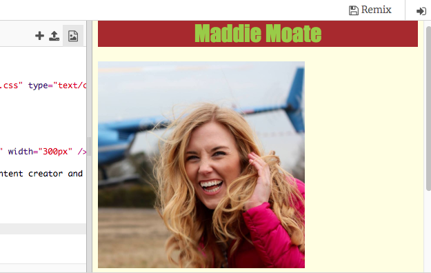

## अपने पेज पर फ़ोटो दिखाएं

आइए अपने वेब पेज पर एक तस्वीर जोड़ें!

--- task ---

अपने HTML कोड पर जाने के लिए `index.html` नाम के टैब पर क्लिक करें । निम्नलिखित वाक्य `<body> </body>` टैग के बीच कहीं भी टाइप करें।

```html
    
```

परिणाम ऐसा दिखना चाहिए:



--- /task ---

--- task ---

ध्यान दें कि `` टैग के अंदर अतिरिक्त जानकारी है। उन्हें **ऐट्रिब्यूट्स (attributes)** कहा जाता है ।

कोड में `width="200px"` ढूंढें और विभिन्न संख्याओं के साथ प्रयोग करके देखें ताकि आप यह पता लगा सकते हैं कि यह ऐट्रिब्यूट क्या करता है। हालांकि `px` अक्षर न हटाएं! 'px' का अर्थ 'पिक्सेल (pixel)' है।

--- collapse ---
---
title: img टैग कैसे काम करता है
---

आपने देखा होगा कि `` टैग आपके द्वारा अब तक उपयोग किए गए अन्य टैग से अलग है - इसमें कोई बंद करने वाला `</img>` टैग नहीं है। इसके बजाय, यह टैग **स्व-समापन** है: इसके अंत में `/>` है। इसका कारण यह है कि छवि एलीमेंट्स (elements) का कोई 'प्रारंभ' और 'अंत' नहीं है, जैसे टेक्स्ट (text) के लिए होता है।

टैग के **ऐट्रिब्यूट्स** में अतिरिक्त जानकारी है:
- `src` ऐट्रिब्यूट ब्राउज़र को बताती है कि चित्र के लिए किस फ़ाइल का उपयोग करना है।
- `alt` ऐट्रिब्यूट एक छोटा विवरण है जो ब्राउज़र पर दिखेगा अगर वह चित्र प्रदर्शित नहीं हो पाया। 'ऑल्ट (alt)' का पूर्ण रूप 'अल्टरनेटिव' है जिसका मतलब विकल्प होता है। यह पाठ दृश्य हानि वाले लोगों की भी मदद करता है जो स्क्रीन रीडर का उपयोग करके यह जानते हैं कि आप उन्हें किस चित्र में क्या दिखा रहे हैं।
- `width`ऐट्रिब्यूट ब्राउज़र को बताती है कि चित्र को कितना चौड़ा बनाना है। `100px` का मतलब एक सौ पिक्सेल (pixels) है। यदि आप इस ऐट्रिब्यूट को शामिल नहीं करते हैं, तो चित्र को उसके मूल आकार में प्रदर्शित किया जाएगा।

--- /collapse ---

--- /task ---

अब जब आप अपनी वेबसाइट पर एक तस्वीर डालने के लिए कोड जानते हैं, तो आप शायद तस्वीर बदलना चाहते हैं, है ना? **यदि आपके पास एक Trinket खाता है**, तो आप अपनी वेबसाइट पर अपनी तस्वीर पाने के लिए नीचे दिए गए निर्देशों का पालन कर सकते हैं। यदि आपके पास कोई खाता नहीं है, तो आप स्टार्टर Trinket में हमारे द्वारा जोड़े गए रॉकेटशिप (rocketship) का उपयोग कर सकते हैं, या मैडी (Maddie) की तस्वीर रख सकते हैं।

--- task ---

निश्चित रूप से पहली चीज जो आपको चाहिए होगी वो है, एक तस्वीर! आप अपने कंप्यूटर पर पहले से मौजूद एक तस्वीर का उपयोग कर सकते हैं, जैसे कि आपके द्वारा लिया गया फोटोग्राफ, या आप एक तस्वीर इंटरनेट से प्राप्त कर सकते हैं।

[[[generic-get-picture-from-web]]]

**ध्यान दें:** सभी तसवीरें जो इंटरनेट पर मिलती हैं वो सब के उपयोग के लिए अनुमति नहीं है। यदि आप कोई चित्र डाउनलोड करते हैं, तो आपको यह सुनिश्चित करना चाहिए की उसे आपको उपयोग करने की अनुमति है। इसके बारे में यहाँ और अधिक जानकारी प्राप्त करें:

[[[images-permissions-to-use]]]

--- /task ---

--- task ---

जब आपके पास एक चित्र हो, तो आप Trinket पर फ़ाइल **अपलोड** कर सकते हैं।

अपने trinket में,**+**  के बगल में **image** चिह्न पर क्लिक करें।


यह वह जगह है जहाँ आप उन तस्वीरों को देख सकते हैं जिनका उपयोग आप अपने वेब पेज पर कर सकते हैं। आपको मैडी (Maddie) की तस्वीर दिखनी चाहिए।

- **Image Library** बटन पर क्लिक करें और फिर **Upload New Image** पर क्लिक करें।

- **Click To Select Images** बटन पर क्लिक करें । खुलने वाली विंडो में अपनी छवि फाइल ढूंढें और डबल क्लिक करें।

- **Done** बटन पर क्लिक करें।


अब आपकी तस्वीर अपलोड की जाएगी और उपयोग करने के लिए तैयार हो जाएगी।

--- /task ---

--- task ---

`index.html` फ़ाइल में जाएँ और `` टैग ढूंढें। `maddie.jpg` को बदलें ताकि यह आपके द्वारा चुनी गई छवि फाइल के नाम से पूरी तरह मेल खाता हो। ध्यान दें कि इसका नाम `.jpg` के बजाय किसी भिन्न समाप्ति के साथ समाप्त हो सकता है! यह समाप्ति ** file extension ** है और दिखाता है कि आपकी तस्वीर किस प्रकार की फ़ाइल में कंप्यूटर पर संग्रहीत है। छवियों के लिए अन्य समान एक्सटेंशन (extension) में `.png`, `.gif` और `.tiff`, और अधिक शामिल हैं।

आपके द्वारा अभी-अभी बदला गया टेक्स्ट `src` नामक एट्रिब्यूट है, सोर्स (source) का संक्षिप्त रूप, जो ब्राउज़र को बताता है कि किस फ़ाइल को प्रदर्शित करना है।

**ध्यान दें:** किसी एट्रिब्यूट के लिए आपके द्वारा टाइप की गई वैल्यू (value) उद्धरण चिह्न `" "` के अंदर होनी चाहिए!

--- /task ---

--- task ---

अब चलिए `img` पर CSS कोड के साथ एक बॉर्डर जोड़ते हैं - `.css` फाइल पर स्विच करना सुनिश्चित करें । हमें यहां जो प्रॉपर्टी चाहिए वह है `border` । यहां विभिन्न सीमा विकल्पों में से बहुत सारे हैं, और आप यहां पूरी सूची पा सकते हैं: **[Borders](https://www.w3schools.com/css/css_border.asp)** । हम एक उदाहरण के रूप में सबसे छोटे का उपयोग करेंगे:

```css
img{
    border: 2px solid Black; 
}
```

यहां पहली वैल्यू (value) `2px`, पिक्सेल(छोटे डॉट्स जो कंप्यूटर स्क्रीन बनाते हैं, याद आया) में border की चौड़ाई है । दूसरी वैल्यू (value) बॉर्डर स्टाइल का वर्णन करती है; इस मामले में यह `solid` है, लेकिन आप `dotted` या `dashed` भी बना सकते हैं । अंतिम वाला बॉर्डर का रंग है।

**ध्यान दें:** अब आप `मार्जिन`प्रॉपर्टी का उपयोग कर सकते हैं, अपनी छवि की जगह बदलने के लिए!

--- /task ---


