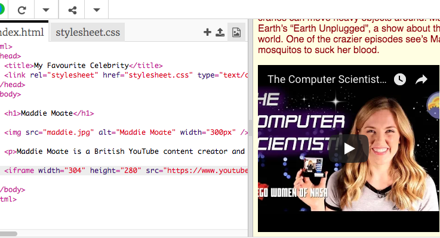

## अपने पेज पर YouTube वीडियो जोड़ें

अन्य ऑनलाइन स्रोतों से एलीमेंट्स (elements) को जोड़ना ** embedding** कहलाता है । YouTube आपके लिए अपनी वीडियो को आपकी वेबसाइट पर जोड़ने का एक आसान तरीका देता है। आइए आपकी हस्ती के बारे में एक वीडियो शामिल करें। इस उदाहरण के लिए, हम Maddie के YouTube चैनल से एक वीडियो जोड़ रहे है, लेकिन आप अपनी पसंदीदा हस्ती के साथ एक साक्षात्कार, संगीत वीडियो, मूवी ट्रेलर, या कोई अन्य क्लिप जोड़ सकते हैं।

--- task ---

YouTube पर एक वीडियो ढूंढें जिसे आप अपनी वेबसाइट पर दिखाना चाहते हैं।

वीडियो के नीचे, पसंद के बगल में बने ** Share** बटन पर क्लिक करें । ** Embed** विकल्प का चयन करें।

आपको इसमें कुछ कोड के साथ एक टेक्स्ट (text) बॉक्स दिखाई देगा, जिसे आपको कॉपी करना होगा। ऐसा करने का सबसे आसान तरीका है: सारा चुनने के लिए उस पर क्लिक करें और <kbd> Ctrl </kbd> (या <kbd> cmd </kbd> एक Mac पर) और <kbd>A </kbd> अपने कीबोर्ड पर एक ही समय में दबाएं।

फिर टेक्स्ट को कॉपी करने के लिए <kbd> Ctrl </kbd> (या <kbd> cmd </kbd> एक Mac पर) और <kbd> C </kbd> अपने कीबोर्ड पर एक ही समय पर दबाएँ, या राइट-क्लिक करें और ** कॉपी करें ** ।

--- /task ---

--- task ---

अब अपनी वेबसाइट के HTML कोड पर वापस जाएं, और उस स्थान पर क्लिक करें जहां आप वीडियो डालना चाहते हैं, उदाहरण के लिए एक शीर्षक या अनुच्छेद के नीचे। आपके द्वारा कॉपी किया गया कोड को जोड़ने के लिए <kbd> Ctrl </kbd> (या <kbd> cmd </kbd> एक Mac पर) और <kbd> V </kbd> अपने कीबोर्ड पर एक साथ दबाएं, या राइट-क्लिक करें और ** Paste ** चुनें। आपके द्वारा अभी-अभी पेस्ट किए गए सभी कोड को समझने की चिंता न करें! आपको अपने वेब पेज पर वीडियो दिखाई देना चाहिए।

यदि आप ध्यान से देखें, तो आपको `width` और ` height` **एट्रीब्यूट्स (attributes)** पेस्ट किए गए कोड में मिलनी चाहिए। वीडियो को बड़ा या छोटा दिखाने के लिए आप उनकी वैल्यू (value) बदल सकते हैं।

--- /task ---

