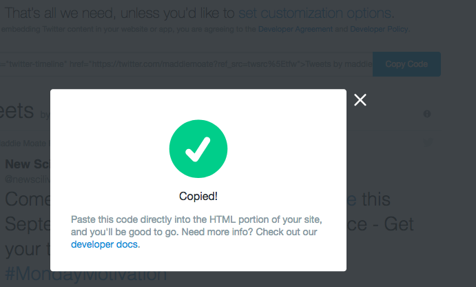

## एक Twitter प्रोफ़ाइल प्रदर्शित करें

Twitter भी आपको अपने वेब पेज पर इसकी सेवाओं का उपयोग करने का एक आसान तरीका प्रदान करता है। यह उदाहरण वेब पेज पर Maddie के Twitter प्रोफाइल को एम्बेड करने जा रहा है, अपने पसंदीदा सेलिब्रिटी के प्रोफाइल को भी जोड़ें, अगर उनके पास Twitter हो।

--- task ---

सबसे पहले, Twitter पर अपने पसंदीदा सेलिब्रिटी को खोजें, और उस वेब पते को कॉपी करें जो आपके ब्राउज़र के एड्रेस बार (address bar) में है, जैसा कि नीचे की छवि में देखा जा सकता है ।

(क्या आप जानते हैं कि 'वेब एड्रेस' के लिए तकनीकी शब्द 'URL' है, जो 'यूनिफ़ॉर्म रिसोर्स लोकेटर' (Uniform Resource Locator) का संक्षिप्त रूप है)

--- /task ---

--- task ---

फिर, [ publish.twitter.com ](https://publish.twitter.com) {:target="_blank"} पर जाएं, पेज के मध्य में स्थित बॉक्स में URL पेस्ट करे, और बॉक्स के पास तीर पर क्लिक करें।

फिर बाईं ओर पर स्थित **Embedded Timeline** विकल्प चुनें।

यदि आप चाहें तो अब आप अनुकूलन विकल्पों का चयन कर सकते हैं। **Customization options** पर क्लिक करें और **How would you like this to look?** सेटिंग को **Light** से ** Dark ** में बदलें या ** Width** और ** Height ** को अपडेट करें । आप जो भी विकल्प चाहें, उसे बदलें और फिर ** update**पर क्लिक करें ।

जब आप कर लें, या यदि आपने कोई सेटिंग नहीं बदली है, तो ** Copy Code ** बटन पर क्लिक करें । इससे आप के स्क्रीन पर यह संदेश "Copied!" पॉप अप होना चाहिए।

--- /task ---

--- task ---

फिर अपनी वेबसाइट के HTML कोड पर वापस जाएं, उस स्थान पर क्लिक करें जहां आप Twitter प्रोफाइल डालना चाहते हैं, और कोड पेस्ट करें। फिर से, उन सभी कोड को समझने के बारे में चिंता न करें जिन्हें आपने अभी-अभी पेस्ट किया है!

--- /task ---

