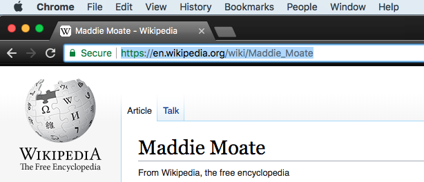

## अन्य वेबसाइटों के लिंक बनाएं

अब आप किसी अन्य वेबसाइट का एक ** लिंक ** अपने पेज पर जोड़ने जा रहे हैं । अपने उदाहरण के रूप में, हम Maddie के Wikipedia पेज का एक लिंक जोड़ेंगे: [wikipedia.org/wiki/Maddie_Moate](https://en.wikipedia.org/wiki/Maddie_Moate){:target="_blank"}

--- task ---

किसी अन्य वेबसाइट से लिंक करने के लिए, आपको `<a> </a>` टैग का उपयोग करना होगा। ` a ` ** एंकर (anchor)** का संक्षिप्त रूप है । यह मेरे उदाहरण लिंक के लिए कोड है:

```html
<a href="https://en.wikipedia.org/wiki/Maddie_Moate" > यह Maddie के Wikipedia पेज का लिंक है। </a>
```

` href ` एट्रिब्यूट (attribute) में उस वेबसाइट का URL होना चाहिए जिसे आप लिंक करना चाहते हैं। `<a>` और `</a>` के बीच वह टेक्स्ट (text) है जो आपके पेज पर दिखाई देगा और लोग लिंक की गई वेबसाइट पर जाने के लिए उस पर क्लिक कर सकेंगे।



--- /task ---

--- task ---

डिफ़ॉल्ट रूप से, आपके द्वारा जोड़ा गया कोई भी लिंक नीला होगा और उनके नीचे एक रेखा होगी। यह बदलने के लिए कि वे कैसे दिखते हैं, आप निम्नलिखित CSS नियम का उपयोग कर सकते हैं:

```css
a {
    text-decoration: none;
    color: black;
}
```

आप आसानी से एक नई लाइन में भी अपने लिंक को ले जा सकते हैं! बस इसे पैराग्राफ टैग `<p>` से घेरें:

```html
<p><a href="MyLink">My Text</a></p>
```

--- /task ---

--- collapse ---
---
title: कुछ लिंक काम नहीं कर रहे हैं?
---

अधिकांश बड़ी वेब सेवाएं (web services), जैसे Twitter और Facebook, अपनी वेबसाइट को `<iframe>` में खोलने की अनुमति नहीं देते हैं, जो कि Trinket आपकी वेबसाइट को दाईं ओर बॉक्स में आपको दिखाने के लिए उपयोग करती है। यदि आप अपना HTML कोड को डाउनलोड करते हैं और इसे ब्राउज़र से खोलते हैं, तो ऐसी साइटों के लिंक काम करेंगे, क्योंकि आपका ब्राउज़र iframes का उपयोग नहीं करता है। लेकिन अगर आप एट्रिब्यूट (attribute) `target="_blank"` को एक लिंक के `<a>` एंकर टैग में जोड़ते हैं, तो यह Trinket में काम करेगा: लिंक की गई वेबसाइट एक नए ब्राउज़र टैब में खुलेगी।

```html
<a href="https://www.twitter.com/" target="_blank"> एक नए टैब में खुलता है </a>
```

--- /collapse ---


