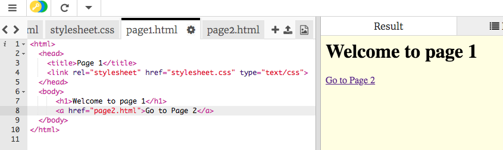

## चुनौती: अधिक पेज

--- challenge ---

जो आपने अभी सीखा है उसका उपयोग करके, अपने पसंदीदा बैंड के सदस्यों, अपनी पसंदीदा मूवी या टीवी शो के कलाकारों या अपनी पसंदीदा स्पोर्ट्स टीम के खिलाड़ियों के बारे में और अधिक वेब पेज बनाएं!

--- collapse ---
---
title: Trinket पर एक नई फाइल कैसे बनाएं
---

+ अपनी वर्तमान फ़ाइलों `index.html` और`stylesheet.css` के दाईं ओर स्थित प्लस बटन पर क्लिक करें।

+ एक फाइल नाम दर्ज करें, उदाहरण के लिए `bandmember1.html` या `eddiemurphy.html` । **`.html` शामिल करना याद रखें!**

+ निम्न मूल HTML कोड को कॉपी और पेस्ट करें, जिसे अक्सर **बॉयलरप्लेट (boilerplate) कोड** कहा जाता है:

``` html
    <html>
    <head>
        <title>My Title</title>
        <link rel="stylesheet" href="stylesheet.css" type="text/css">
    </head>
    <body>

    </body>
    </html>
```

--- /collapse ---

--- collapse ---
---
title: अपने एक पेज से दूसरे पेज पर कैसे जाएं
---

+ अपने दो पेजों के बीच एक लिंक बनाने के लिए, आप `<a> </a>` टैग का उपयोग कर सकते हैं ।

+ खुलने वाले टैग में एक `href` एट्रिब्यूट (attribute) लगाएं और इसे उस पेज के फाइल नाम के समान `=` सेट करें जिससे आप इसे लिंक लरना चाहते हैं। हमेशा की तरह, खुलने और बंद होने वाले टैग के बीच के टेक्स्ट को वेब पेज पर लिंक के रूप में प्रदर्शित किया जाएगा।

``` html
    <html>
    <head>
        <title>Page 1</title>
        <link rel="stylesheet" href="stylesheet.css" type="text/css">
    </head>
    <body>
        <h1>Welcome to page 1</h1>
        <a href="page2.html">Go to Page 2</a>
    </body>
    </html>
```



--- /collapse ---

--- /challenge ---

यहाँ एक वेबसाइट है जिसे मैंने अपनी पसंदीदा फुटबॉल टीम, FC बार्सिलोना के बारे में बनाया है:

<div class="trinket">
  <iframe src="https://trinket.io/embed/html/4dbd80d6d3?outputOnly=true&start=result" width="600" height="505" frameborder="0" marginwidth="0" marginheight="0" allowfullscreen>
  </iframe>
</div>


***
इस परियोजना का अनुवाद स्वयंसेवकों ने किया:

Hitesh Kumar

Nilutpol Kashyap

स्वयंसेवकों को धन्यवाद, हम दुनिया भर के लोगों को अपनी भाषा में सीखने का मौका दे सकते हैं। आप स्वेच्छा से अधिक लोगों तक पहुँचने में मदद कर सकते हैं - [rpf.io/translate](https://rpf.io/translate) पर अधिक जानकारी प्राप्त करें।
